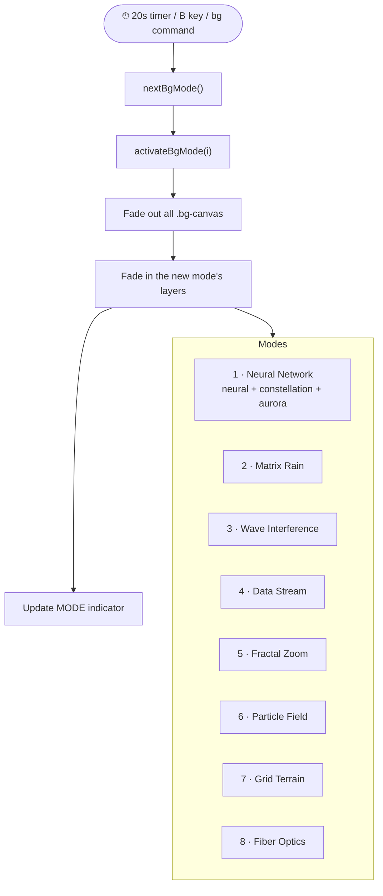
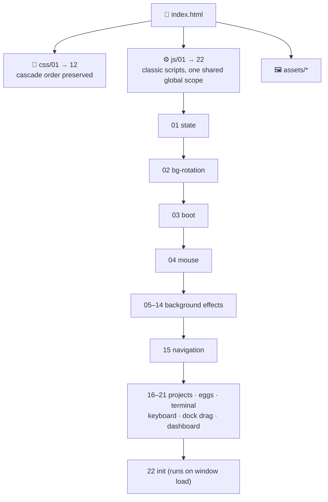
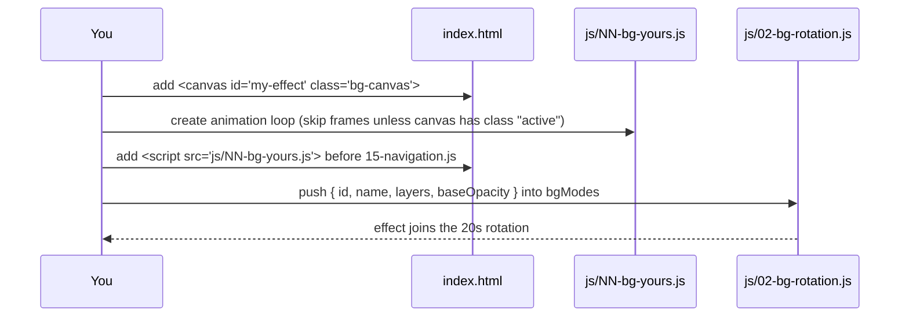

<div align="center">

# ⚡ AI FOUNDRY

### An immersive, sci-fi "laboratory" portfolio — built with zero dependencies.

**Md Abu Tawsif** · Automation Engineer & AI Systems Architect · Bangladesh 🇧🇩


[**Personal Profile ↗**](https://tawssif.vercel.app) · [**GitHub**](https://github.com/taw-ssif26) · [**LinkedIn**](https://www.linkedin.com/in/md-abu-tawsif-50826a3b7) · [**Email**](mailto:taw.ssif26@gmail.com)

</div>

---

## 📖 Table of Contents

- [Overview](#-overview)
- [Features](#-features)
- [The Rooms](#-the-rooms)
- [Controls](#-controls)
- [Terminal Commands](#-terminal-commands)
- [Background Engine](#-background-engine)
- [Project Structure](#-project-structure)
- [How the Files Connect](#-how-the-files-connect)
- [Quick Start](#-quick-start)
- [Deployment](#-deployment)
- [Customization Guide](#-customization-guide)
- [Browser Support & Performance](#-browser-support--performance)
- [Contact](#-contact)

---

## 🧭 Overview

**AI Foundry** is a single-page, room-based portfolio styled as an "Advanced Automation Laboratory". Instead of scrolling a normal page, visitors boot a system, then move between **rooms** (Gate, Core, Lab, Network, Workspace, Terminal, Vault, Command) using a navigation dock or the keyboard.

It is pure **HTML + CSS + vanilla JavaScript**: no framework, no bundler, no `npm install`. Open `index.html` and it runs.

---

## ✨ Features

| Area | What you get |
|---|---|
| 🚀 **Boot sequence** | Animated canvas loader with progress ring, percentage counter and hex-grid overlay. Press any key to skip. |
| 🌌 **8 rotating backgrounds** | Auto-switches every 20 s with a live mode indicator. |
| 🧭 **Room navigation** | 8 rooms with animated transitions, dock navigation, keyboard control. |
| 🧪 **Projects Lab** | 5 expandable project cards with live-style metrics, tech tags and activation toasts. |
| 🕸️ **Skill network** | 17 skill nodes with animated connector lines and hover tooltips. |
| 💻 **Interactive terminal** | 15 working commands with command history (↑ / ↓). |
| 📊 **Live dashboard** | Draggable, closable system-metrics panel + FPS counter + clock in the HUD. |
| 🥚 **Easter eggs** | Konami code unlocks a hidden room (`SECTOR 7G`), plus terminal secrets. |
| 🖱️ **Custom cursor** | Glowing cursor + ring that reacts to interactive elements. |
| 📱 **Responsive** | Breakpoints at 1200px, 768px, 480px, plus touch and reduced-motion handling. |

---

## 🚪 The Rooms

```mermaid
flowchart LR
    G["🚪 Gate<br/>entrance"] --> C["🔵 Core<br/>identity + stats"]
    C --> L["🧪 Lab<br/>5 projects"]
    L --> N["🕸️ Network<br/>skill map"]
    N --> W["🖥️ Workspace<br/>desk + about"]
    W --> T["⌨️ Terminal<br/>interactive CLI"]
    T --> V["🏆 Vault<br/>metrics"]
    V --> CM["📡 Command<br/>contact"]
    CM -.->|"Konami code"| S["🔒 Sector 7G<br/>hidden room"]

    style G fill:#0d1117,stroke:#58a6ff,color:#c9d1d9
    style C fill:#0d1117,stroke:#58a6ff,color:#c9d1d9
    style L fill:#0d1117,stroke:#d29922,color:#c9d1d9
    style N fill:#0d1117,stroke:#39c5cf,color:#c9d1d9
    style W fill:#0d1117,stroke:#58a6ff,color:#c9d1d9
    style T fill:#0d1117,stroke:#3fb950,color:#c9d1d9
    style V fill:#0d1117,stroke:#d29922,color:#c9d1d9
    style CM fill:#0d1117,stroke:#58a6ff,color:#c9d1d9
    style S fill:#0d1117,stroke:#f85149,color:#f85149
```



| Room | Dock label | Purpose |
|---|---|---|
| `entrance` | **Gate** | Landing screen with the "Initialize System" button |
| `core` | **Core** | Name, role and headline stats |
| `projects` | **Lab** | Project workstations WS-001 → WS-005 |
| `factory` | **Network** | Interactive skill interconnection map |
| `research` | **Workspace** | Hoverable desk objects + about text |
| `terminal` | **Terminal** | Working command-line interface |
| `vault` | **Vault** | Achievement / metrics grid |
| `contact` | **Command** | Contact form UI + direct channels |
| `secret` | *(hidden)* | `SECTOR 7G` — unlocked with the Konami code |

> The dock also includes a **Personal Profile ↗** link that opens [tawssif.vercel.app](https://tawssif.vercel.app) in a new tab.

---

## 🎮 Controls

| Input | Action |
|---|---|
| `→` / `D` | Next room |
| `←` / `A` | Previous room |
| `Esc` | Return to the Gate |
| `B` | Cycle to the next background effect |
| `↑ ↑ ↓ ↓ ← → ← → B A` | Konami code → unlock **Sector 7G** |
| Any key during boot | Skip the boot sequence |
| Click + drag on the dock | Scroll the navigation dock |
| Click + drag on the dashboard | Move the Live Systems panel |
| Hover the dashboard → ✕ | Close the panel |

---

## ⌨️ Terminal Commands

Open the **Terminal** room and type:

| Command | Output |
|---|---|
| `help` | List all commands |
| `about` | Developer info |
| `skills` | Core technologies |
| `projects` | Active project list |
| `contact` | Contact details |
| `whoami` | Current identity |
| `ls` · `pwd` · `cat` | Fake filesystem helpers |
| `history` | Commands entered this session |
| `clear` | Clear the screen |
| `bg` | Cycle the background effect |
| `debug` | Show room / background / boot state |
| `secret` · `easteregg` | ??? |

Use `↑` / `↓` to browse command history.

---

## 🎨 Background Engine

Ten stacked `<canvas>` layers form **8 modes**. Only the active mode's layers are visible and animating; inactive ones idle cheaply.



---

## 🗂️ Project Structure

```text
ai-foundry/
├── index.html                 # Markup only + ordered <link>/<script> tags
├── README.md
├── CONTEXT.md                 # Build status / decisions log
├── assets/                    # Images used by the page
│   ├── tlogo.jpeg             #   favicon
│   ├── macbook.jpeg  desktop.jpeg  kb.png  notebook.png
│   ├── coffee.jpg    plant.jpeg    pic.jpg
│   └── 1000056406.jpg         #   portrait
├── css/
│   ├── 01-base.css            # variables, reset, body, custom cursor
│   ├── 02-boot.css            # boot screen
│   ├── 03-backgrounds.css     # canvas layers + transition overlay
│   ├── 04-hud.css             # HUD, dashboard, toast, nav dock
│   ├── 05-rooms.css           # room shell, Gate, Core
│   ├── 06-projects.css        # Lab cards
│   ├── 07-skills-network.css  # Network room
│   ├── 08-workspace.css       # Workspace room
│   ├── 09-terminal.css        # Terminal room
│   ├── 10-contact.css         # Command room
│   ├── 11-vault-secret.css    # Vault, secret room, scrollbars
│   └── 12-responsive.css      # all @media rules  (keep last)
└── js/
    ├── 01-state.js            # shared global state
    ├── 02-bg-rotation.js      # background modes + 20s rotation
    ├── 03-boot.js             # boot sequence
    ├── 04-mouse.js            # cursor + HUD coordinates
    ├── 05-bg-neural.js        ┐
    ├── 06-bg-constellation.js │
    ├── 07-bg-aurora.js        │
    ├── 08-bg-matrix.js        │ one file per
    ├── 09-bg-wave.js          │ background effect
    ├── 10-bg-datastream.js    │
    ├── 11-bg-fractal.js       │
    ├── 12-bg-particles.js     │
    ├── 13-bg-grid.js          │
    ├── 14-bg-fiber.js         ┘
    ├── 15-navigation.js       # goToRoom + skill connectors
    ├── 16-projects.js         # Lab toggle / activate
    ├── 17-easter-eggs.js      # toast + Konami code
    ├── 18-terminal.js         # terminal UI + commands
    ├── 19-keyboard.js         # keyboard navigation
    ├── 20-navdock-drag.js     # drag-to-scroll dock
    ├── 21-dashboard.js        # dashboard drag, metrics, FPS
    └── 22-init.js             # startup on window load
```

---

## 🔌 How the Files Connect

`index.html` is the only entry point. It loads every stylesheet and script in a fixed order.



**Rules that keep it working**

1. **Order matters.** Files use numeric prefixes so load order equals dependency order. If you rename or reorder one, update `index.html`.
2. **Classic `<script>` tags, not ES modules.** All files share one global scope, so inline `onclick` handlers (`goToRoom`, `showEgg`, `toggleLab`, `activateProject`) work and the site opens from `file://` without a server.
3. **`12-responsive.css` stays last** so media queries override the base styles.

---

## 🚀 Quick Start

**Option 1 — Open directly**

```bash
git clone https://github.com/taw-ssif26/ai-foundry.git
cd ai-foundry
# double-click index.html, or:
open index.html          # macOS
xdg-open index.html      # Linux
start index.html         # Windows
```

**Option 2 — Local server (recommended while developing)**

```bash
# Python
python3 -m http.server 8000

# or Node
npx serve .
```

Then visit **http://localhost:8000**.

> Keep the folder structure intact. If `index.html` is moved away from `css/`, `js/` and `assets/`, the page will load unstyled.

---

## 🌐 Deployment

It is a static site, so any static host works.

### GitHub Pages

1. Push the repo to GitHub.
2. Go to **Settings → Pages**.
3. Under **Source**, choose **Deploy from a branch**, select `main` and `/ (root)`, then **Save**.
4. Your site is live at `https://<username>.github.io/<repo>/`.

### Vercel

```bash
npm i -g vercel
vercel          # follow the prompts, framework preset: "Other"
```

### Netlify

Drag the project folder into [app.netlify.com/drop](https://app.netlify.com/drop).

---

## 🛠️ Customization Guide

| I want to… | Edit |
|---|---|
| Change colors / theme | CSS variables in `css/01-base.css` (`:root`) |
| Change name, role, stats | `index.html` → `#room-core` |
| Add or edit a project | `index.html` → `#room-projects` (copy a `.project-lab-card`) and its message in `js/16-projects.js` |
| Add a skill node | `index.html` → `#skills-network` (add a `.skill-node`, set `left` / `top`) |
| Change desk photos | Replace files in `assets/` or edit `#workspace-desk` |
| Update contact links | `index.html` → `#room-contact` and the `contact` command in `js/18-terminal.js` |
| Add a terminal command | Add an entry to the `commands` object in `js/18-terminal.js` |
| Change background speed | `BG_ROTATION_INTERVAL` in `js/02-bg-rotation.js` |
| Add a background effect | New `<canvas class="bg-canvas">` in `index.html`, new `js/NN-bg-*.js`, then a new entry in `bgModes` |
| Add a new room | Add a `.room` div + a `.nav-item`, then add its id to the `rooms` array in `js/01-state.js` |

### Adding a background effect (example flow)



---

## 🌍 Browser Support & Performance

- Works in current Chrome, Edge, Firefox and Safari.
- The **Wave Interference** and **Fractal Zoom** modes compute per-pixel frames and are the heaviest. On low-end devices, remove them from `bgModes` in `js/02-bg-rotation.js`.
- Animations are shortened automatically for users with `prefers-reduced-motion`.
- Touch devices get always-visible action buttons and the system cursor.
- The page loads fonts from Google Fonts (**Space Mono**, **Syne**, **Inter**) and falls back to system monospace / sans-serif offline.

---

## 📡 Contact

| Channel | Link |
|---|---|
| 📧 Email | [taw.ssif26@gmail.com](mailto:taw.ssif26@gmail.com) |
| 💼 LinkedIn | [/in/md-abu-tawsif-50826a3b7](https://www.linkedin.com/in/md-abu-tawsif-50826a3b7) |
| 🐙 GitHub | [@taw-ssif26](https://github.com/taw-ssif26) |
| 📸 Instagram | [@taw_ssif](https://www.instagram.com/taw_ssif) |
| 👤 Personal Profile | [tawssif.vercel.app](https://tawssif.vercel.app) |

---

<div align="center">

© Md Abu Tawsif. All rights reserved.

*Built to make technology serve people, not the other way around.*

</div>
